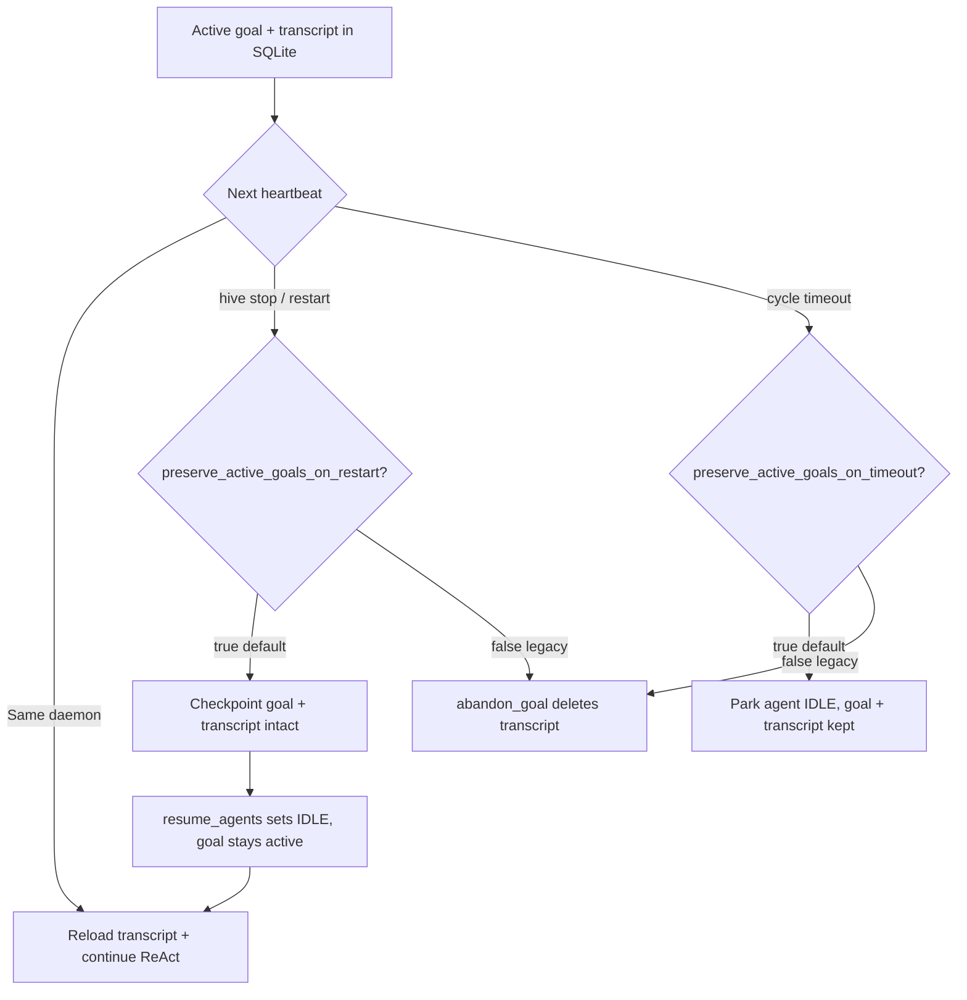

# Daemon Mode

Daemon mode is where Hive becomes an agent OS. Instead of running single tasks, agents persist across cycles, generate their own goals, experience suffering, interact with each other, and live in a simulated economy.

## The Heartbeat Loop

The `HiveDaemon` drives all agents in a shared loop. Each heartbeat (default 10s):

1. Hot-load plugins (every 10 cycles)
2. For each alive agent:
    - Escalate all active stressors
    - Apply suffering effects to Persona behavioral params
    - If agent has an active goal: pursue it via ReAct loop
    - If agent is idle: generate a new goal via ExistenceLoop (or custom GoalStrategy)
    - Log suffering state, emit lifecycle events
3. Auto-kill expired sub-agents (see [Sub-agents](#sub-agents))
4. Every 5 cycles: swarm learning across agents
5. If economy enabled: process payday and roll life events

## Starting the Daemon

**CLI:**

```bash
hive init
hive start -p coder,gambler,philosopher --heartbeat 10
```

`hive start --heartbeat` writes the value to `.hive/config.yaml` before the daemon starts, so the first config reload on heartbeat tick keeps the CLI override (no silent revert to an old on-disk value).

**Python API:**

```python
from hive import Hive

hive = Hive()
hive.init()
hive.spawn("coder")
hive.spawn("gambler")
hive.start(heartbeat=10, cycles=50)
```

## Operating a Running Daemon

The daemon writes its PID to `.hive/daemon.pid`, so it can be controlled
from any other terminal in the same project directory:

```bash
hive daemon              # health: PID, uptime, agent counts, budget
hive daemon pause        # freeze all agent cycles (ManualPauseGuard)
hive daemon resume       # clear daemon-wide freeze
hive stop                # graceful SIGTERM, SIGKILL after --timeout
hive restart -p coder    # stop + start
hive pause coder         # skip this agent each heartbeat (per-agent status)
hive pause --all         # pause every live agent individually
hive resume coder        # back to idle
hive budget              # cost kill-switch status
```

**Per-agent pause** sets `AgentStatus.PAUSED` in SQLite — the agent keeps its
state, goals, and memory, but the daemon skips it each heartbeat. Paused agents
remain paused across daemon restarts until explicitly resumed.

**Daemon freeze** (`hive daemon pause`) blocks all agent cycles via
`ManualPauseGuard` on every cycle phase. It is independent of per-agent pause:
you can freeze the daemon while individual agents remain `idle`, or pause agents
while the daemon heartbeat continues for others.

The same operations are available over REST: per-agent
(`POST /agents/{id}/pause`, `/resume`), daemon freeze (`POST /daemon/pause`,
`/resume` when `hive serve --with-daemon`), and budget (`GET /budget`,
`POST /budget/reset`). See [REST API](rest-api.md#operations-endpoints).

## Config hot-reload vs restart

`PATCH /config` (and manual edits to `.hive/config.yaml`) validate and write
immediately. The running daemon **does not** reload every field on each change —
only a documented hot subset is applied on the next heartbeat via
`HiveDaemon.reload_config()`. Everything else requires `hive restart`.

| Key / prefix | Live reload? | Notes |
|--------------|--------------|-------|
| `daemon.heartbeat` | Yes | Sleep interval between cycles |
| `daemon.cycle_timeout` | Yes | Per-agent cycle wall clock |
| `daemon.max_concurrent_agents` | Yes | Heartbeat concurrency cap |
| `daemon.wake_poll_interval` | Yes | A2A / nudge / watch-file poll rate |
| `daemon.tool_timeout` | Yes | Per-tool wall clock |
| `daemon.max_steps_policy`, `pursuit_resume`, `pursuit_transcript_max_messages` | Yes | Pursuit behavior |
| `retention.*` | Yes | Janitor schedule (when enabled) |
| `event_log_fsync` | Yes | Event log durability (`EventLog._fsync`) |
| `daemon.preserve_active_goals_on_restart`, `daemon.preserve_active_goals_on_timeout` | **Restart** | Goal/transcript continuity on stop/start and timeout |
| `daemon.max_retries` | **Restart** | Read at cycle init, not refreshed in `reload_config()` |
| `logs_dir` | **Restart** | `LogWriter` path fixed at daemon init (resolved from config at start) |
| `guardrails.*`, `approval.*`, `plugins.*`, `tools.*` | **Restart** | Safety pipeline, toolkits rebuilt at init |
| `daemon.budget_*`, `daemon.guards_fail_closed`, `daemon.watch_files`, `daemon.toolkit_cache` | **Restart** | Budget tracker, guards, wake sources |
| `economy.*`, `model.*`, `memory.*`, `server.*`, `suffering.*` | **Restart** | World layer, providers, API auth |
| `seed`, `profiles_dir` | **Restart** | RNG / profile discovery |

`PATCH /config` returns a `reload` map per changed key (`applied` or
`restart_required`). Disable per-agent toolkit reuse with
`daemon.toolkit_cache: false` if you need to force fresh toolkit instances each
cycle without restarting.

See also: [System overview](system-overview.md) for how config, daemon, and REST
fit together.

## Cost Budget Kill-Switch

Set a daemon-wide spend ceiling in `.hive/config.yaml` (or via
`HIVE_BUDGET_USD` / `HIVE_BUDGET_TOKENS`):

```yaml
daemon:
  budget_usd: 5.0      # 0 = unlimited (kill-switch off)
  budget_tokens: 0     # 0 = unlimited (kill-switch off)
  budget_mode: reserve # reserve | record_only (legacy overshoot window)
  budget_reserve_usd_generation: 0.05
  budget_reserve_usd_pursuit: 0.10
  budget_persist: false  # when true, spent totals survive restart (.hive/budget.json)
  max_steps_policy: continue  # continue | abandon when pursuit hits profile max_steps
  pursuit_resume: true  # reload ReAct transcript for active goals (Phase C)
  pursuit_transcript_max_messages: 200  # cap stored messages per goal
  preserve_active_goals_on_restart: true  # keep active goals + transcripts on stop/start
  preserve_active_goals_on_timeout: true  # park on cycle timeout without abandoning goal
  guards_fail_closed: true  # block LLM phases when a safety guard errors (default)
```

Set `budget_reserve_*` to at least your typical per-phase LLM cost so the
reservation model can enforce a hard ceiling under concurrency. Undersized
estimates re-open a small overshoot window of `N × (actual − estimate)`.

## Profile limits and step policy

Each agent profile (`profiles/<name>.yaml`) carries pursuit knobs the daemon honors on every heartbeat:

| Profile field | Default | Effect |
|---------------|---------|--------|
| `max_steps` | `20` | ReAct loop cap per pursuit cycle (standalone SDK default is 25) |
| `temperature` | `0.0` | Passed to the runtime `Agent` and goal-generation LLM calls |
| `max_cost_usd` | `0.0` | Per-agent spend cap during pursuit (`0` = unlimited) |
| `max_tokens` | `4096` | Token limit forwarded to providers where supported |

When pursuit hits `max_steps` before the goal completes, `daemon.max_steps_policy` controls the outcome:

- **`continue`** (default): keep the goal **active**, set agent status back to `idle`, log a `max_steps` goal event, emit `goal_max_steps` hook. The pursuit transcript is persisted so the next heartbeat resumes the ReAct conversation instead of restarting from scratch.
- **`abandon`**: mark the goal abandoned (legacy fail-fast behavior). Transcript rows for that goal are deleted.

## Pursuit continuity (multi-heartbeat resume)

When `daemon.pursuit_resume` is `true` (default), the daemon stores serialized ReAct messages per active goal in SQLite (`pursuit_transcripts` table via `memory/pursuit_transcript.py`):

1. **First cycle** on a goal: `DaemonAgentAdapter` sends the objective plus pursuit context as a single user message, runs up to `profile.max_steps`, then saves the conversation buffer.
2. **Later cycles** while the goal stays active: the adapter reloads the transcript, injects fresh pursuit context as a system note (`Updated pursuit context:`), and continues the ReAct loop for another `max_steps` slice.
3. **Goal complete or abandon**: `HiveStore.complete_goal` / `abandon_goal` deletes the transcript archive for that `goal_id`.



**Stop/restart caveats:**

- With default `preserve_active_goals_on_restart: true`, `hive stop` and `hive restart` keep in-flight goals and pursuit transcripts. The next heartbeat resumes pursuit from the stored ReAct buffer (requires `pursuit_resume: true`).
- Parked approval agents (`WAITING` + pending approval) were already preserved across restart; that path is unchanged.
- Set `preserve_active_goals_on_restart: false` to restore legacy cleanup that abandons active goals on shutdown and resume (deletes transcripts).
- Cycle timeout with default `preserve_active_goals_on_timeout: true` parks the agent to `idle` without abandoning the goal; the next heartbeat retries pursuit with the same transcript.
- Abandon stale goals manually with `hive goals abandon` when you intentionally want to discard in-flight work.

Rollback to legacy single-shot pursuit: set `pursuit_resume: false` in `.hive/config.yaml`.

Transcript size is capped by `pursuit_transcript_max_messages` (drop-oldest policy, preserving assistant/tool groups). Session JSONL logs remain an audit trail; they are not replayed automatically -- the transcript store is the resume source of truth.

Custom `GoalStrategy` implementations share the same validation path as `ExistenceLoop` unless `GoalContext.skip_validation=True` or the strategy class sets `skip_validation = True` for trusted plugins.

A `BudgetTracker` accumulates USD and token spend across all agents. In
`budget_mode: reserve` (default), the daemon holds a configurable estimate
before each goal-generation or goal-pursuit LLM call; only one concurrent batch
of agents can pass when remaining budget is tight. Once either limit is reached,
a `CostBudgetGuard` vetoes goal-pursuit and goal-generation phases for every
agent, and an `on_exceeded` callback sets a daemon-wide kill-switch flag so
life-event LLM calls also stop. Cycle timeouts and cancellations still commit
best-effort spend (reserved estimate or partial runtime totals) so timed-out
pursuits do not drop tokens from the ledger.

The daemon process itself stays up for housekeeping (retention, alarms,
metrics). Check status with `hive budget` or `GET /budget` — both report
`unlimited (budget_usd=0)` prominently when both limits are `0`. Reset counters
with `hive budget reset` or `POST /budget/reset`. Set `budget_persist: true`
to load/save spent totals from `.hive/budget.json` across restarts.

## Sub-agents

Parent agents can spawn child agents via `SubAgentToolkit` (`spawn_sub_agent`). The
daemon auto-kills expired sub-agents each heartbeat (step 3 above). Depth and fan-out
limits remain enforced (`MAX_DEPTH=2`, `MAX_CHILDREN=5`).

Sub-agents receive a **restricted toolkit allowlist** by default -- not the full parent
set. Built-in defaults include file, memory, notepad, web, knowledge, links, clipboard,
comms, a2a, task, alarm, and sub_agents. Shell, git, delegation, schedule, orchestrator,
plugins, and world are excluded.

Override in `.hive/config.yaml`:

```yaml
tools:
  sub_agent_toolkits: ["file", "notepad"]  # custom allowlist; omit sub_agents to block further spawning
```

When `sub_agent_toolkits` is unset (`null`), the secure built-in default applies. Setting
it explicitly can re-enable high-risk toolkits (e.g. shell) for sub-agents -- only do so
if you accept the privilege-multiplication risk.

## Cycle Phases and Guards

Each agent cycle moves through formal phases: `approval_gate` →
`suffering_escalation` → `context_assembly` → `goal_pursuit` /
`goal_generation` → `cleanup`. Every transition emits `phase_enter` /
`phase_exit` hooks, and a `PhaseGuard` can veto entry into a phase:

```python
from hive.daemon.phase import CyclePhase, PhaseGate

class MaintenanceWindowGuard:
    async def should_proceed(self, gate: PhaseGate) -> bool:
        return not is_maintenance_window()

daemon.hooks.register_guard(CyclePhase.GOAL_PURSUIT, MaintenanceWindowGuard())
```

When any guard returns `False` the phase is skipped and the cycle returns
`"guarded"`. Built-in guards use **fail-closed** semantics when
`daemon.guards_fail_closed` is true (default): if `CostBudgetGuard` or
`ManualPauseGuard` raises internally, the phase is blocked.

| Phase | Built-in guards |
|-------|----------------|
| All phases | `ManualPauseGuard` (daemon freeze via `hive daemon pause`) |
| `goal_pursuit`, `goal_generation` | `CostBudgetGuard` (budget kill-switch) |

Third-party guards registered without `fail_closed=True` still fail open on
errors for backward compatibility.

## Event-Driven Wakeups

Instead of always sleeping the full heartbeat interval, the daemon races
`WakeSource` instances against the timer and starts the next cycle as soon
as one fires. By default:

- `A2AWakeSource` — new A2A inbox activity under `<hive>/a2a/`
- `NudgeWakeSource` — new marker files under `<hive>/nudges/` (written by `hive nudge`)

Optional: set `daemon.watch_files` in config to register `FileWakeSource` per path.
Implement `async def wait(self) -> str` and call `daemon.add_wake_source(...)` for
custom sources.

## Goal Generation

When an agent has no active goal, the ExistenceLoop generates one by:

1. Checking for scheduled goals due this cycle
2. Checking for pending nudges from users
3. Analyzing the agent's suffering state, peer activity, and recent history
4. Asking the LLM to generate a goal given this context

High `risk_tolerance` prompts ambitious goals. High `social_drive` prompts collaborative goals. Low `concentration` causes more goal switching.

### Custom Goal Strategy

Override goal generation with the `GoalStrategy` protocol. Every call must return a
`GeneratedGoal` with spend metadata (`cost_usd`, `tokens`), even when `objective` is
`None`:

```python
from hive import GoalStrategy, GoalContext, GeneratedGoal, HiveDaemon

class MyStrategy:
    async def generate_goal(self, context: GoalContext) -> GeneratedGoal:
        if context.nudges:
            return GeneratedGoal(objective=f"Handle: {context.nudges[0]}")
        return GeneratedGoal(objective=None)

daemon = HiveDaemon(hive_dir=Path(".hive"), goal_strategy=MyStrategy())
```

## Lifecycle Hooks

Register callbacks for daemon events using `HookRegistry`:

```python
daemon.hooks.on("goal_completed", lambda agent_id, goal_id, **kw:
    print(f"{agent_id} completed {goal_id}"))
```

**Available events:**

| Event | Parameters | When |
|-------|-----------|------|
| `cycle_start` | `agent_id`, `cycle_num` | Beginning of each cycle |
| `cycle_end` | `agent_id`, `cycle_num`, `result` | End of each cycle |
| `goal_generated` | `agent_id`, `goal_id`, `objective` | New goal created |
| `goal_completed` | `agent_id`, `goal_id` | Goal finished successfully |
| `goal_abandoned` | `agent_id`, `goal_id` | Goal given up |
| `goal_max_steps` | `agent_id`, `goal_id`, `steps_done` | Pursuit hit profile step limit (continue policy) |
| `suffering_changed` | `agent_id`, `suffering_state` | Suffering state updated |

Handlers can be sync or async. Exceptions in handlers are logged but don't crash the daemon.

```python
# Async handler
async def on_suffering(agent_id: str, suffering_state: Any, **kwargs: Any) -> None:
    if suffering_state.cumulative_load > 0.8:
        print(f"WARNING: {agent_id} approaching crisis")

daemon.hooks.on("suffering_changed", on_suffering)

# Remove handler
daemon.hooks.off("suffering_changed", on_suffering)
```

## Human-in-the-Loop Approvals

Some tools should not run without a human's say-so. Enable approvals in
`.hive/config.yaml` and mark which tools are gated:

```yaml
approval:
  enabled: true
  require_for: ["shell_exec", "git_commit"]   # tool names always gated
  auto_approve: []                             # names never gated (overrides flags)
  timeout_cycles: 0                            # auto-deny after N heartbeats (0 = never)
```

A tool can also opt in at definition time with `@tool(requires_approval=True)`.

When a gated tool is called, the agent **parks**: it does not run the tool, an
approval record is persisted, and its status becomes `waiting_approval`. Because
agents are heartbeat-driven records (not live coroutines), the pause survives across
cycles -- each heartbeat the park gate holds the agent cheaply (no model call) until
the request is resolved. The goal stays active throughout.

Resolve from the CLI or the [REST API](rest-api.md#human-in-the-loop-approvals):

```bash
hive approvals                 # list pending requests
hive approve ap-1a2b3c         # let the tool run next cycle
hive deny ap-1a2b3c --reason "too risky"   # agent sees the denial and re-plans
```

An approval is granted for a specific `(tool, arguments)` pair and is single-use:
re-running the same call later prompts again. `timeout_cycles` auto-denies a request
that sits unresolved too long.

## Guardrails

Guardrails inspect content around the model -- a **pre-hook** on the task input and a
**post-hook** on the final output (the model-I/O analog of lifecycle hooks). Enable
them in `.hive/config.yaml`:

```yaml
guardrails:
  enabled: true
  pii: true                 # redact PII in output
  prompt_injection: true    # block injection phrasing in input
  pii_action: redact        # flag | redact | block
  injection_action: block   # flag | redact | block
```

Built-ins: **PII** (emails, phones, SSNs, cards, IPs) and **prompt injection**
("ignore previous instructions", "you are now …", jailbreak phrasing). Each action is
`flag` (log only), `redact` (mask matches), or `block` (refuse the input / withhold the
output). A blocked input fails the task; a blocked output is replaced with a notice.
Add your own via the `Guardrail` protocol and `GuardrailRegistry`.

## Life Events

The event engine rolls random events each cycle (30% probability). Events force agents to make decisions that affect their stats and suffering.

**Event categories:** career, health, social, financial, random.

**How events work:**

1. Each cycle, `EventEngine.roll_events()` checks for follow-ups and rolls a random event
2. The event is formatted as a prompt with numbered choices
3. The agent's LLM picks a choice
4. Outcomes apply stat effects (money, happiness, reputation) with a luck multiplier (mean 1.0, std 0.25)
5. Some outcomes queue follow-up events for future cycles

**Example event flow:**

```
Event: "A freelance gig appeared paying $200, but it's outside your skill set."
  Choice 1: Take it anyway (risky but rewarding)
  Choice 2: Pass on it (safe but no income)
  Choice 3: Negotiate for training time (balanced)

Agent with high risk_tolerance -> Choice 1
Luck roll: 1.4 (lucky!) -> Earns $280, gains new skill
```

## Agent-to-Agent Protocol (A2A)

Agents communicate via a typed messaging system backed by JSONL files.

**9 message types:**

| Type | Purpose | Auto-reply type |
|------|---------|-----------------|
| REQUEST | Ask for help | RESPONSE |
| RESPONSE | Answer a request | - |
| QUERY | Ask a question | ANSWER |
| ANSWER | Answer a query | - |
| REVIEW | Request peer review | FEEDBACK |
| FEEDBACK | Provide review | - |
| DELEGATE | Assign a task | ACK or REJECT |
| ACK | Accept delegation | - |
| REJECT | Decline with reason | - |

**Collaboration patterns** (pre-built interaction flows):

| Pattern | Description |
|---------|-------------|
| ReviewPattern | Code/work review between two agents |
| MentorPattern | Mentee asks mentor a question |
| DebatePattern | Two agents debate a topic in rounds |
| ChainPattern | Task passes through a chain of agents |
| SwarmTaskPattern | Task broadcast to all agents in parallel |

## Semantic Memory

Agents share one semantic memory backend per agent at `.hive/memory/<agent_id>/` (JSONL + TF-IDF search). The daemon caches `SemanticMemory` in `AgentContextCache.get_memory()`; `MemoryToolkit`, `KnowledgeToolkit`, and pursuit recall all use the same instance when `memory.unified: true` (default).

**Pursuit:** completed goals are stored via `memory.store(...)` after success; the next pursuit cycle recalls up to 3 relevant entries into the LLM via `PersistentMemory` on the runtime `Agent`.

**Goal generation:** `agent_cycle.py` calls `recall_snippets()` and injects a `--- Relevant memories ---` section into the existence prompt (or `GoalContext.memory_snippets` for custom strategies).

Legacy key-value files under `.hive/agent_memory/{id}.json` are imported once on first access (`memory/migration.py`). Set `memory.unified: false` in config to keep JSON-only toolkit behavior.

```python
from hive.memory.semantic import SemanticMemory

memory = SemanticMemory(hive_dir=Path(".hive"), agent_id="coder")
await memory.store("Learned that the auth module needs refactoring")
results = await memory.search("authentication issues", top_k=5)
```

| Method | Description |
|--------|-------------|
| `store(thought, metadata)` | Store a thought, return memory_id |
| `search(query, top_k=5)` | Find similar memories by TF-IDF |
| `recall(memory_id)` | Retrieve specific memory by ID |
| `forget(memory_id)` | Delete a memory |
| `consolidate(max_age_days, min_access)` | Remove old/unused memories |
| `recent(limit=5)` | Get most recent memories |

Each `MemoryRecord` tracks: `memory_id`, `thought`, `metadata`, `ts`, `access_count`, `last_accessed`.

## Checkpointing

Save and restore agent state snapshots for debugging or recovery.

```python
from hive.checkpoint import CheckpointManager

mgr = CheckpointManager(hive_dir=Path(".hive"))

# Save
cp_id = mgr.save(
    agent_id="coder",
    label="before-risky-change",
    suffering=suffering_state,
    identity=identity,
    ctx=execution_context,
)

# Restore
checkpoint = mgr.restore("coder", cp_id)

# Compare two checkpoints
diff = mgr.diff(checkpoint_a, checkpoint_b)
```

A checkpoint captures: suffering state, active goals, agent identity, world state (balance, job, skills), and persona snapshot.

## Benchmarking

Compare model performance on identical scenarios.

**CLI:**

```bash
hive benchmark --models anthropic:lite,openai:lite,ollama:standard --cycles 5
```

**Python:**

```python
from hive.benchmark.runner import BenchmarkRunner

runner = BenchmarkRunner(hive_dir=Path(".hive"))
result = await runner.run_goal_benchmark(
    models=["anthropic:lite", "openai:lite"],
    cycles=5,
    runs=3,
)
```

Results include: goals completed/abandoned, total tokens, cost, duration, and errors per model.

## HTML Export

Export a recorded run as a standalone HTML report.

**CLI:**

```bash
hive export <run-id> --output report.html
```

**Python:**

```python
from hive.export.html import export_html_report

export_html_report(
    run_id="abc123",
    logs_dir=Path(".hive/logs"),
    output_path=Path("report.html"),
)
```

Reports include agent cards, goal timelines, notepad contents, A2A message threads, and cost tracking. Dark theme, no external dependencies.

## MCP Server

Hive exposes itself as an MCP server so external tools (like Claude Code) can control agents **on the same machine** via stdio.

**Trust model:** MCP stdio assumes a **trusted local operator**. There is no network authentication layer — anyone who can launch `hive-mcp` with access to your project directory can spawn agents, nudge them, and read logs. Do not expose the MCP subprocess over SSH tunnels or remote shells without equivalent host access controls. For remote or multi-user control, use `hive serve` with `server.api_key` instead.

The MCP surface is intentionally **smaller than REST**: lifecycle and agent ops only (no config PATCH, budget reset, or daemon pause over MCP today). See the tool list below.

```bash
hive-mcp
```

**Exposed tools:** `hive_init`, `hive_start`, `hive_stop`, `hive_status`, `hive_spawn`, `hive_kill`, `hive_nudge`, `hive_logs`, `hive_models`.

Connect from Claude Code or any MCP client by adding to your MCP config:

```json
{
  "mcpServers": {
    "hive": {
      "command": "hive-mcp"
    }
  }
}
```
