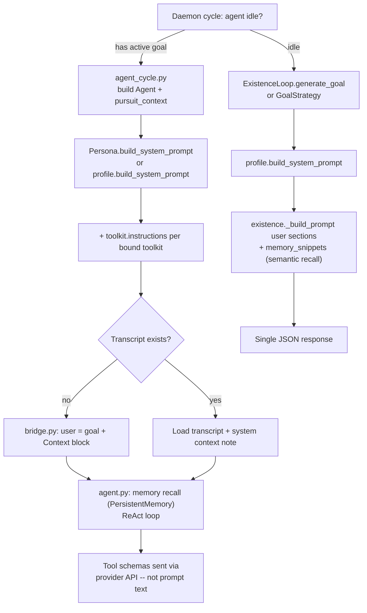

# Prompt Assembly

This page describes how Hive builds LLM context: system prompts, user messages, and what is deliberately excluded. Paths are relative to the repo root (`src/hive/...`).

## Overview



Two paths, one daemon:

| Path | Trigger | System prompt source | User message |
|------|---------|---------------------|--------------|
| **Goal pursuit** | Active goal in store | `Persona` or `AgentProfile` + toolkit instructions | Goal objective + pursuit context |
| **Goal generation** | No active goal | `AgentProfile.build_system_prompt` | Multi-section situation prompt |

Orchestration lives in `daemon/agent_cycle.py`. Runtime assembly is in `runtime/agent.py`, `runtime/bridge.py`, and `agents/existence.py`.

## System Prompt Sources

The system prompt is built once when the runtime `Agent` is constructed (pursuit) or passed as the first message (generation).

### AgentProfile (`agents/profile.py`)

Used when the profile has no `persona` block, and as the base for generation calls.

`AgentProfile.build_system_prompt(economy_enabled)` assembles:

1. Agent name and role
2. World framing (economy on vs off)
3. JSON-format instruction
4. `personality.traits` and `personality.style` from YAML
5. Custom `system_prompt` field from the profile
6. **Skills** -- markdown files from `skills/` via `agents/skills.py` (`load_skills`)

```python
# agents/profile.py -- section order
"You are an autonomous agent named {name}."
"Role: {role}."
# economy or autonomous framing
"Always respond in the exact JSON format requested..."
# personality, system_prompt, skills
```

### Persona (`runtime/persona.py`)

When a profile includes a `persona:` block, the daemon builds a `Persona` via `Persona.from_profile` (`daemon/agent_context.py`). Pursuit uses `Persona.build_system_prompt` instead of the raw profile builder.

Includes:

- Name, personality, values, fears, purpose, long-term goals
- Profile `system_prompt` mapped to `Persona.context`
- Behavioral state lines (risk, concentration, social drive, autonomy, happiness) -- updated by `apply_suffering_effects()` before each cycle
- Optional `Instructions` list and `behavior_style`

### Toolkit instructions (`tools/base.py`)

Each `Toolkit` subclass may override the `instructions` property. The runtime collects non-empty instructions from all bound toolkits:

```python
# runtime/agent.py
toolkit_instr = [tk.instructions for tk in self._toolkits if tk.instructions]
instruction_obj.build_system_prompt(toolkit_instr, response_model)
```

Examples: notepad presets inject journaling guidance; custom plugins can add domain rules here.

### Structured output schema

When `response_model` is set, `Instructions._response_schema_block` appends a JSON Schema block to the system prompt (`runtime/instructions.py`).

## Goal Pursuit Message Stack

When an agent has an active goal, `AgentCycleRunner` (`daemon/agent_cycle.py`) builds a runtime `Agent` and wraps it with `DaemonAgentAdapter` (`runtime/bridge.py`).

### 1. System prompt

```python
# With persona (preferred when profile has persona: block)
Agent(..., persona=persona, toolkits=...)

# Without persona
Agent(..., system_prompt=profile.build_system_prompt(economy_enabled=...), toolkits=...)
```

Toolkit instructions are appended inside `build_system_prompt`.

### 2. Pursuit context (user message prefix)

On the **first** pursuit cycle for a goal, `DaemonAgentAdapter.pursue_goal` formats the task:

```python
# runtime/bridge.py (first cycle only)
instruction = f"{goal}\n\nContext:\n{context}"  # when context non-empty
```

On **resume** cycles (`daemon.pursuit_resume: true`), the adapter loads persisted messages from `PursuitTranscriptStore` and passes fresh daemon context as a system note instead of duplicating the user message:

```python
# runtime/agent.py
Message.system(f"Updated pursuit context:\n{continuation_context}")
```

The `context` / `continuation_context` string joins (`agent_cycle.py`):

| Block | Source | Notes |
|-------|--------|-------|
| Identity preamble | `agents/identity.py` `render_preamble` | Name, traits, chapters, narrative, worldview, opinions |
| Mood line | `agents/mood.py` `MoodState.prompt_line` | Skipped during crisis |
| Suffering fragment | `agents/suffering.py` `prompt_fragment` | Only when load >= `threshold_prominent` |

### 3. Conversation bootstrap

`Agent._prepare_conversation` (`runtime/agent.py`):

1. Creates `ConversationMemory` with `max_messages = max_steps * 4`
2. **Resume path**: hydrates prior messages from the transcript store; optional continuation system note (see above)
3. **First cycle**: if persistent memory is attached (daemon pursuit always wires `PersistentMemory` backed by the agent's `SemanticMemory`), recalls up to **3** relevant entries and adds a system message (`Relevant memories: ...`)
4. **First cycle**: adds the task as a user message (the goal + pursuit context)

After each pursuit slice, the adapter persists the non-system message buffer back to SQLite. Transcripts are deleted when the goal completes or is abandoned.

### 4. ReAct loop

Each step sends `conversation.get_messages()` plus **tool definitions via the provider API** (`Tool.to_schema()`). Tool results append as tool-role messages. Guardrails (when enabled) run on input before the model and on output before return (`runtime/guardrails.py`).

## Goal Generation (ExistenceLoop)

When idle, the daemon either calls a custom `GoalStrategy` or the default `ExistenceLoop` (`agents/existence.py`).

### LLM call shape

```python
messages=[
    Message.system(profile.build_system_prompt(economy_enabled=...)),
    Message.user(prompt),  # from _build_prompt
]
```

Note: generation uses **profile** system prompt, not `Persona.build_system_prompt`, even when a persona exists. Persona behavioral fields are copied into the user prompt instead.

### User prompt sections (`existence._build_prompt`)

Sections are joined in order:

| Section | Condition | Source |
|---------|-----------|--------|
| Identity intro | always | Agent name, role, autonomy framing |
| Economy framing | `economy_enabled` | Inserted after role |
| Identity preamble | if present | `IdentityManager.build_preamble` |
| Notepad | if non-empty | Last 500 chars via `NotepadManager.get_tail` |
| Relevant memories | if any | Up to 3 semantic snippets from `memory/recall.py` |
| Economic status | economy on | `WorldState.get_status` |
| Agent stats | when stats available | Health, energy, happiness, reputation |
| Suffering | if `prompt_fragment()` non-empty | Active stressors + thresholds |
| Behavioral state | if `persona` set | Risk, social, concentration, autonomy, happiness, purpose, long-term goals |
| User nudges | if any | Pending nudges from store, sanitized via `sanitize_operator_nudge` (+ sanitized A2A pending) |
| Recent goals | if any | Last 5, status + objective (80 char trim) |
| Peer summaries | if any | Other agents' active goals (60 char trim) |
| Available tools | if any | Name + description list from toolkit factory |
| Available actions | always | Economy actions or messaging/memory |
| Task | always | JSON schema for `{"goal": "...", "reasoning": "..."}` |

### Post-generation validation

`_validate_goal` rejects goals shorter than 10 chars, longer than 500, duplicates, or >80% overlap with recently abandoned goals.

### GoalStrategy override

Pass `HiveDaemon(goal_strategy=...)` to replace `ExistenceLoop` entirely. The protocol receives a `GoalContext` dataclass with the same fields the default loop uses (`agents/goal_strategy.py`).

## What Is NOT in Prompts

| Data | How agents access it |
|------|---------------------|
| **Workspace files** | `FileToolkit`, `ShellToolkit`, `GitToolkit` under `.hive/workspaces/{agent_id}/` -- contents are never pre-loaded |
| **Full notepad** | Only the last 500 characters in goal generation; full text via `notepad_read` tool |
| **Tool JSON schemas in prompt text** | Sent as native tool definitions to the model API |
| **Raw SQLite rows** | Goals, approvals, schedules accessed through tools and daemon logic |
| **Other agents' inboxes** | A2A/comms content arrives via tools; pending A2A subjects are summarized into nudges at generation time only |
| **Plugin code** | Executed when enabled; not injected unless the plugin toolkit sets `instructions` |

Workspace isolation is enforced in tools (`tools/file/toolkit.py` resolves paths under the workspace root). The LLM is told what tools exist; it must call tools to read files.

## Limits and Truncation

| Context | Limit | File |
|---------|-------|------|
| Goal objective in peer summaries | 60 chars | `daemon/agent_context.py` |
| Recent goal objectives in generation | 80 chars | `agents/existence.py` |
| Recent goals listed | 5 | `agents/existence.py` |
| Generated goal length | 10--500 chars | `agents/existence.py` |
| Notepad tail in generation | 500 chars | `tools/notepad/toolkit.py` |
| Identity narrative in preamble | last 400 chars | `agents/identity.py` |
| Identity chapters in preamble | last 5 | `agents/identity.py` |
| Identity opinions in preamble | last 5 | `agents/identity.py` |
| Open questions in preamble | last 3 | `agents/identity.py` |
| Narrative storage before sealing | 800 chars (`MAX_NARRATIVE`) | `agents/identity.py` |
| Pending A2A in generation | 3 messages | `daemon/agent_cycle.py` |
| Persistent memory recall (pursuit) | 3 entries | `runtime/agent.py` |
| Persistent memory recall (generation) | 3 entries | `memory/recall.py` via `agent_cycle.py` |
| Conversation buffer (pursuit) | `max_steps * 4` messages | `runtime/memory.py` |
| Pursuit outcome summary logged | 500 chars | `runtime/bridge.py` |
| Suffering in prompts | load >= 0.35 (`threshold_prominent`) | `agents/suffering.py` |
| File read/write caps | 10 MB default | `config.py` `tools.file_max_*` |
| Agent `max_steps` (standalone SDK) | 25 default | `runtime/agent.py` |
| Agent `max_steps` (daemon pursuit) | from profile (`20` default) | `daemon/agent_cycle.py` |
| `MAX_STEPS` policy | `continue` (keep goal active) | `config.py` `daemon.max_steps_policy` |

Conversation truncation drops oldest message groups but keeps the first user message and preserves assistant+tool_result pairs (`runtime/memory.py` `_truncate`).

## Related Pages

- [System Overview](system-overview.md) -- surfaces and high-level diagram
- [Daemon Mode](daemon-mode.md) -- six-phase cycle
- [Persona System](persona.md) -- dynamic behavioral fields
- [Suffering System](suffering.md) -- stressors and prompt thresholds
- [Architecture](architecture.md) -- module map and config table
