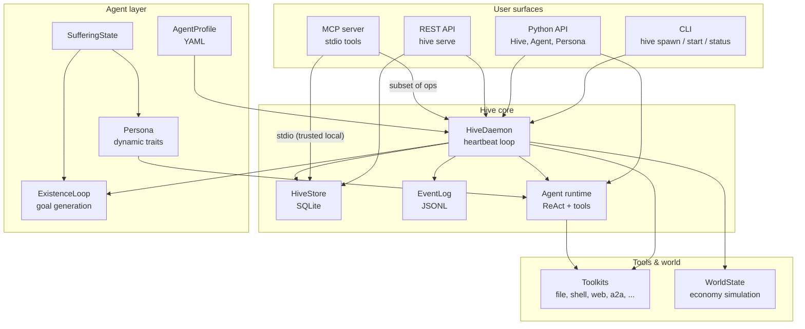
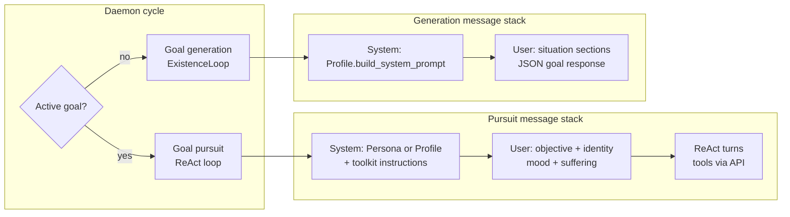

# System Overview

Hive is a **local-first agent OS**. You spawn persistent AI agents from YAML profiles; a background daemon drives them on a heartbeat, they pursue goals with tools, interact with each other, and optionally live in a simulated economy. State lives on disk under `.hive/` -- not in ephemeral API calls.

## Scale Snapshot

Approximate figures for the current tree (soft counts, useful for orientation):

| Metric | Approx |
|--------|--------|
| Python modules under `src/hive/` | ~194 files |
| Lines of Python in `src/hive/` | ~28,000 LOC |
| Built-in toolkit modules | 18 |
| Model providers | 6 (Anthropic, OpenAI, Groq, Fireworks, Ollama, LM Studio) |
| Core package deps | ~15 (`pyproject.toml`) |

Hive is a single installable package (`hive-agent`) with optional extras (`api`, `chromadb`, `audio`, etc.).

## Architecture

**Key idea:** agents are records in SQLite, not OS processes. The daemon is the only driver -- it loads context, calls the LLM, executes tools, and writes logs each heartbeat.

## Surfaces

| Surface | Entry | Use when |
|---------|-------|----------|
| **CLI** | `hive` (Typer) | Day-to-day ops: `init`, `spawn`, `start`, `status`, `pause`, `budget` |
| **Python API** | `from hive import Hive, Agent, Persona` | Scripts, tests, embedding Hive in apps |
| **REST API** | `hive serve` (optional `[api]` extra) | Remote control, dashboards, integrations |
| **MCP** | `hive mcp` stdio server | Drive Hive from Claude Code or other MCP clients on the **same machine** (trusted local operator — not a network auth boundary) |

All surfaces share the same `.hive/` directory, SQLite store, and daemon when running.

## Core Capabilities

### Toolkits

Tools are grouped into `Toolkit` subclasses (`src/hive/tools/`). Each agent gets a per-agent workspace at `.hive/workspaces/{agent_id}/` and toolkits bound to that agent. Parent agents receive the full built-in set; spawned sub-agents get a restricted allowlist by default (see [Hardening Guide](../hardening-guide.md)).

Built-in toolkits include file, shell, git, web, memory, notepad, comms, a2a, delegation, schedule, tasks, alarms, knowledge, links, clipboard, sub-agents, world (when economy is on), orchestrator (when CLI tools are present), and plugins (opt-in).

### Multi-agent

- **A2A messaging** -- typed inter-agent messages with collaboration patterns (round-table, pairs, freeform)
- **Sub-agents** -- parent-child spawning with depth and fan-out limits
- **Delegation** -- route work between agents
- **Swarm learning** -- cross-agent pattern discovery every 5 daemon cycles

### Daemon

The `HiveDaemon` runs a heartbeat (default 10s). Each alive agent goes through six phases per cycle: approval gate, suffering escalation, context assembly, goal pursuit or goal generation, and cleanup. See [Daemon Mode](daemon-mode.md).

### Simulation

When `economy.enabled: true` (default), agents participate in jobs, skills, finances, gambling, and random life events via `WorldToolkit`. Disable economy for pure tool-using agents without the simulation layer.

## Prompt Assembly: Pursuit vs Generation

The daemon uses two distinct LLM call patterns. Both share profile-based system prompts, but the user message and context differ.

| Path | When | LLM role | Output |
|------|------|----------|--------|
| **Goal pursuit** | Agent has an active goal | Multi-step ReAct with tool calls | Complete or abandon goal |
| **Goal generation** | Agent is idle (no scheduled goal) | Single JSON call via `ExistenceLoop` | New goal saved to store |

Pursuit injects identity, mood, and suffering into the **user** message. Generation packs world state, notepad tail, peers, and tool descriptions into one **user** prompt. Details: [Prompt Assembly](prompt-assembly.md).

## Safety Defaults

Hive ships with conservative defaults after the 0.7 hardening pass. Highlights:

| Setting | Default | Effect |
|---------|---------|--------|
| `plugins.enabled` | `false` | No hot-loaded Python from `.hive/plugins/` |
| `tools.shell_allow_dev_commands` | `false` | No python/curl/git in agent shell |
| `tools.shell_pass_env` | `false` | API keys not passed to shell |
| `tools.sub_agent_toolkits` | `null` | Secure allowlist for sub-agents |
| `guardrails.enabled` | `false` | Opt-in PII and injection filters |
| `approval.enabled` | `false` | Opt-in human-in-the-loop tool gates |
| `daemon.guards_fail_closed` | `true` | Safety guard errors block LLM phases |
| `server.api_key` | `""` | No REST auth until you set a key |

File and shell tools enforce workspace isolation under `.hive/workspaces/{agent_id}/`. Web and link fetches route through SSRF guards in `url_safety.py`.

Full audit and migration notes: [Hardening Guide](../hardening-guide.md).

## Config Highlights

All tunables live in `.hive/config.yaml` with env overrides. Most important knobs:

| Section | Key | Default | Notes |
|---------|-----|---------|-------|
| `daemon` | `heartbeat` | `10` | Seconds between cycles |
| `daemon` | `cycle_timeout` | `300` | Per-agent cycle wall clock (0 = none) |
| `daemon` | `budget_usd` / `budget_tokens` | `0` | Spend kill-switch (0 = off) |
| `economy` | `enabled` | `true` | Simulation layer on/off |
| `model` | `default_model` | `claude-haiku-4-5` | Profile fallback model |
| `tools` | `shell_allow_dev_commands` | `false` | Dev shell opt-in |
| `plugins` | `enabled` | `false` | Plugin loading opt-in |
| `guardrails` | `enabled` | `false` | Content filters opt-in |
| `approval` | `enabled` | `false` | HITL tool approval opt-in |
| `server` | `api_key` | `""` | REST bearer key |

Full table: [Architecture -- Configuration](architecture.md#configuration).

## Next Steps

- [CLI Quickstart](../getting-started/cli-quickstart.md) -- run the survival demo
- [Daemon Mode](daemon-mode.md) -- heartbeat, phases, budget
- [Prompt Assembly](prompt-assembly.md) -- what goes into each LLM call
- [Architecture](architecture.md) -- module map and data flow
- [Built-in Toolkits](toolkits.md) -- tool reference
