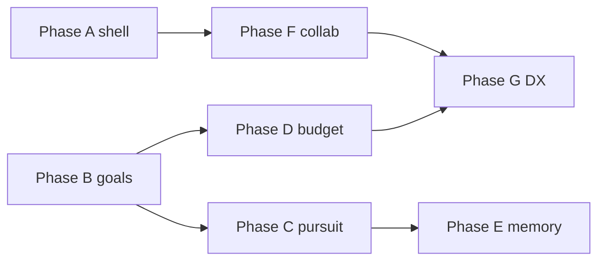

# Fix phases index

Ordered execution plan for **framework correctness** after the security / reliability / agent-loop hunts. The [stability track](stability-index.md) (fail-closed guards, toolkit factory, loop decomposition, adversarial CI gate) is largely complete -- these phases close **residual security bypasses**, **agent-loop lies**, **budget gaps**, and **operator confusion**.

See also: [System overview](../guide/system-overview.md), [Hardening guide](../hardening-guide.md), [Security audit snapshot](../security-audit-2026-07-22.md).

## Recommended execution sequence

| Order | Plan | Effort | Risk | Depends on | Ships after merge |
|-------|------|--------|------|------------|-------------------|
| **A** | [fix-phase-a-shell-containment.md](fix-phase-a-shell-containment.md) | **M** | Med | -- | **Done** -- restricted shell blocks `~`/`$HOME`/flag-value path bypasses; adversarial regressions in CI |
| **B** | [fix-phase-b-goal-lifecycle.md](fix-phase-b-goal-lifecycle.md) | **M** | Med | -- | **Done** -- Profile `max_steps` / temperature honored; `MAX_STEPS` and zombie goals handled with explicit policy + telemetry |
| **D** | [fix-phase-d-budget-hard-ceiling.md](fix-phase-d-budget-hard-ceiling.md) | **M** | Med | B (spend recorded on all exit paths) | **Done** -- reservation hard ceiling, timeout spend accounting, optional persist, unlimited-budget clarity |
| **F** | [fix-phase-f-collaboration-safety.md](fix-phase-f-collaboration-safety.md) | **M** | Med | A (shared sanitization patterns) | **Done** -- Schedule IDOR closed; operator nudges sanitized; optional secure-profile template |
| **C** | [fix-phase-c-pursuit-continuity.md](fix-phase-c-pursuit-continuity.md) | **L** | Med–High | B | **Done** -- Multi-heartbeat goals retain ReAct transcript; resume instead of amnesia each cycle |
| **E** | [fix-phase-e-memory-unification.md](fix-phase-e-memory-unification.md) | **M** | Med | C (pursuit session id stable) | **Done** -- One memory story: recall on pursuit + goal-gen context; `memory_set` visible to daemon semantic store |
| **G** | [fix-phase-g-operator-dx-config-truth.md](fix-phase-g-operator-dx-config-truth.md) | **M** | Low–Med | D, F | **Done** -- Config reload contract + REST docs; toolkit cache; unified goal-gen save/budget ordering |

**All fix phases A–G complete.** Next track: [framework stabilization index](framework-stabilization-index.md) (merge-gate recovery, restart continuity, security closure, operator truth, CI soak). Older deferrals remain under [Out of scope (later backlog)](#out-of-scope-later-backlog) below.

**Start here:** [Phase A](fix-phase-a-shell-containment.md) -- highest severity, smallest blast radius, no dependency on agent-loop redesign.

**Parallelizable after A:** B and F (independent). D should follow B so pursuit/generation spend paths are consistent before reservation logic.

## Dependencies (diagram)



## Effort legend

| Size | Meaning |
|------|---------|
| **S** | ≤ 1 day, mostly tests/docs |
| **M** | 2–3 days, focused module changes |
| **L** | 4+ days or design + multi-PR |

## Risk legend

| Level | Meaning |
|-------|---------|
| **Low** | Docs / perf-only; behavior unchanged or strictly tighter |
| **Med** | Behavior change with tests + rollback via config |
| **Med–High** | Persistence format or pursuit semantics change |

## Out of scope (later backlog)

| Item | Reason |
|------|--------|
| Default `guardrails.enabled: true` / `approval.enabled: true` | Product / deployment template; optional secure profile in Phase F only |
| Full regex guardrail rewrite | Phase F documents bypass limits; replacement engine is a separate track |
| PostgreSQL / second store backend | YAGNI |
| Full swarm routing product feature | Not framework correctness |
| Consolidating `hardening-guide.md` / `hardening-spec.md` / audit doc | Docs hygiene |
| `run_once` vs daemon `run` API parity | Phase G notes gaps; unification is API product work |
| Persona / life-event edge-case sweep | Phase B/G add telemetry hooks; deep persona audit deferred |
| HTTPS IP pinning (optional in F) | Ship only if team accepts TLS/SNI tradeoffs; HTTP pinning already exists |

## Relationship to stability track

| Stability plan | Fix phase overlap |
|----------------|-------------------|
| [stability-03](stability-03-toolkit-factory-hardening.md) orchestrator workspace ctor | Phase F verifies unset-workspace residual; do not duplicate if 03 merged |
| [stability-01](stability-01-daemon-fail-closed.md) budget kill-switch | Phase D adds reservation + timeout spend; builds on 01 |
| [stability-05](stability-05-resilience-test-gate.md) adversarial CI | Every phase extends `tests/adversarial/` |

## Merge gate command

```bash
uv run pytest tests/adversarial/ -v --tb=short
uv run pytest tests/ -v
uv run ruff check src/ tests/
uv run mypy src/
```

## Plan files

1. [fix-phase-a-shell-containment.md](fix-phase-a-shell-containment.md)
2. [fix-phase-b-goal-lifecycle.md](fix-phase-b-goal-lifecycle.md)
3. [fix-phase-c-pursuit-continuity.md](fix-phase-c-pursuit-continuity.md)
4. [fix-phase-d-budget-hard-ceiling.md](fix-phase-d-budget-hard-ceiling.md)
5. [fix-phase-e-memory-unification.md](fix-phase-e-memory-unification.md)
6. [fix-phase-f-collaboration-safety.md](fix-phase-f-collaboration-safety.md)
7. [fix-phase-g-operator-dx-config-truth.md](fix-phase-g-operator-dx-config-truth.md)
