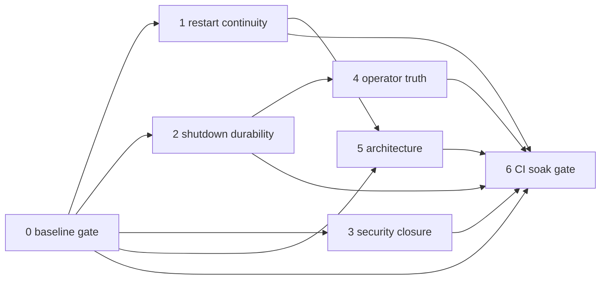

# Framework stabilization index

Synthesized execution plan from five independent Composer audits on branch `fix/framework-hardening`. Phases A--G ([fix-phases-index.md](fix-phases-index.md)) are marked complete; this track closes **measured merge-gate drift**, **verified runtime defects**, **residual security boundaries**, **operator truth gaps**, and **structural debt** while preserving framework behavior.

See also: [System overview](../guide/system-overview.md), [Hardening guide](../hardening-guide.md), [Security audit snapshot](../security-audit-2026-07-22.md), [Stability track](stability-index.md).

## Current health baseline (2026-07-25, measured — post Phase 6)

| Gate | Result | Notes |
|------|--------|-------|
| Full pytest (outside sandbox) | **1865+ passed, 0 failed** | Phases 0–5 complete |
| Coverage | **≥ 77%** (77.65% measured) | CI `--cov-fail-under=77` |
| Ruff check | **0 errors** | Phase 0 complete |
| Ruff format check | **0 files** | 38 files reformatted in Phase 0 |
| Mypy | **0 errors** | Phase 0 complete |
| Adversarial | **243/243** | Wake test stabilized (test-only filter) |
| MkDocs `--strict` | **Pass** | CI docs job |
| `uv build` (clean archive) | **Pass** | CI `build-clean` job via `git archive` |
| `uv build` (Conductor workspace) | **Fail** | Absolute symlink `.conductor/settings.local.toml` — workspace artifact only |

### Deterministic test drift (10 failures — resolved in Phase 0)

| Failure cluster | Root cause | Phase | Status |
|-----------------|------------|-------|--------|
| 6x `TestGoalValidation` | Calls removed `ExistenceLoop._validate_goal`; logic moved to `goal_persistence.validate_goal` | 0 | **Fixed** |
| `test_daemon_timeout` | Patches removed `HiveDaemon._run_agent_cycle_inner`; now `AgentCycleRunner.run_guarded` | 0 | **Fixed** |
| Budget concurrency test | In-memory config; heartbeat reloads disk so expected `3` becomes `7`/default `8` | 0 | **Fixed** |
| Phase `FakeBudget` | Missing `is_at_capacity()` required by `CostBudgetGuard` | 0 | **Fixed** |
| `test_solid_validation` | `agent_cycle.py` **791 lines** vs guard **600** | 0 (waive temporarily) / 5 (split) | **Fixed** (Phase 5 split) |

## Priority and dependency order

| Order | Plan | Effort | Risk | Depends on | Rationale |
|-------|------|--------|------|------------|-----------|
| **0** | [stabilization-00-baseline-merge-gate.md](stabilization-00-baseline-merge-gate.md) | **S--M** | Low | -- | Cannot trust regressions until static + deterministic tests are green |
| **1** | [stabilization-01-restart-timeout-continuity.md](stabilization-01-restart-timeout-continuity.md) | **M** | Med--High | 0 | **VERIFIED** — preserve flags default true; restart/timeout no longer abandon |
| **2** | [stabilization-02-shutdown-budget-durability.md](stabilization-02-shutdown-budget-durability.md) | **M** | Med | 0; soft 1 | PID ordering, budget flush, duplicate-start signal; economy reservation verify |
| **3** | [stabilization-03-security-boundary-closure.md](stabilization-03-security-boundary-closure.md) | **M--L** | Med | 0 | Shell oracle, sub-agent sanitization, web_search SSRF, API key, env scrubbing |
| **4** | [stabilization-04-operator-truth-parity.md](stabilization-04-operator-truth-parity.md) | **M** | Low--Med | 2 | Standalone budget CLI, profile paths, config effective/persisted/live, doctor |
| **5** | [stabilization-05-architecture-stabilization.md](stabilization-05-architecture-stabilization.md) | **L** | Med--High | 0, 1 | Split `agent_cycle.py` after baseline green; secure-minimal REST factory |
| **6** | [stabilization-06-ci-soak-gate.md](stabilization-06-ci-soak-gate.md) | **S--M** | Low | 0--5 | **VERIFIED** — layered CI gates, soak cron, coverage floor 77 |

**Start here:** [Phase 0](stabilization-00-baseline-merge-gate.md) -- restore merge gate before behavior changes.

**Parallelizable after Phase 0:** Phases 2 and 3 (independent slices). Phase 4 can overlap Phase 3 late slices. Phase 5 split PR 1 should wait until Phase 0 test fixes land; full decomposition waits for Phase 1 continuity tests.

## Dependencies (diagram)



## Severity rubric

| Label | Meaning | Response |
|-------|---------|----------|
| **Verified defect** | Reproducible runtime or test failure; multiple audits agree | Fix in named phase; acceptance test required |
| **Risk / hypothesis** | Plausible failure mode without confirmed bypass or flake-only signal | Instrument or characterize before code change |
| **P0** | Data loss, security bypass, or control-plane exposure | Blocks merge gate recovery |
| **P1** | Incorrect framework semantics (continuity, budget, operator lies) | Fix before "framework working properly" exit |
| **P2** | DX, docs, structural debt, optional hardening | Scheduled; YAGNI cuts documented per phase |

## Decision log (audit conflict resolution)

| Topic | Audit disagreement | Decision |
|-------|-------------------|----------|
| **Config reload security** | Some audits feared hot-reload silently drops guardrails | **Not a current bug.** Phase G correctly classifies guardrails, tools, budget-style init keys as **restart-required**. Phase 4 improves stale vs live visibility; do **not** hot-rebuild security components by default. |
| **REST one-shot toolkit parity** | Docs imply daemon == REST tool surface | **Intentional smaller blast radius.** Phase 5 adds **shared secure-minimal factory**, not full dangerous toolkit parity. `CommsToolkit` guardrail gap is in scope. |
| **Wake-source task leak** | Intermittent adversarial failure vs real leak | **Resolved in Phase 0** — test counted global pending tasks; fixed with wake-owned filter. Production cancel path unchanged. |
| **Local REST no API key** | Security vs local-first | **By design** on loopback. Phase 3 enforces API key for **non-loopback** binds only; document in REST + deployment guides. |
| **MCP stdio auth** | Implied network auth model | **Trusted-host model.** Phase 4 documents explicitly; no fake network auth layer. |
| **`uv build` failure** | Packaging regression vs workspace artifact | **Confirmed workspace artifact** — clean `git archive` build passes; Conductor absolute symlink is not a packaging regression. |
| **HTTPS IP pinning** | Listed in security audits | **Backlog** -- known residual; not new work in this track. |
| **`create_subprocess_shell`** | Parser differential risk | **Risk / hypothesis** -- characterize and document; no bypass confirmed today. |
| **Phase C vs restart** | Docs say resume; code abandons | **Verified defect** -- Phase 1 supersedes Phase C acceptance for restart path. |

## Master exit criteria ("framework working properly")

All must be true before declaring this track complete:

1. **Merge gate green:** `uv run pytest tests/ -v`, `uv run pytest tests/adversarial/ -v --tb=short`, `uv run ruff check src/ tests/`, `uv run ruff format --check src/ tests/`, `uv run mypy src/`, `uv run mkdocs build --strict`, clean-checkout `uv build`.
2. **Continuity:** Real stop/start integration test preserves active goal + pursuit transcript under default policy; cycle timeout parks without transcript deletion (Phase 1).
3. **Durability:** Shutdown writes checkpoints and final budget persist before PID release; duplicate live daemon start returns explicit error (Phase 2).
4. **Security slices merged:** Shell `test`/`sort -T` closed or explicitly characterized; sub-agent objective sanitization; `web_search` uses shared URL safety; non-loopback API key enforced (Phase 3).
5. **Operator truth:** Standalone `hive budget` status/reset; profile dir resolution unified; config effective/persisted/live documented in CLI + REST (Phase 4).
6. **Architecture guard:** `agent_cycle.py` modules each under 600 lines with characterization tests passing (Phase 5).
7. **CI encoded:** Phase 6 thresholds in `.github/workflows/ci.yml`; adversarial + integration jobs required on PR. **Done.**

## Suggested PR boundaries (do not batch)

| PR | Scope | Isolation rationale |
|----|-------|---------------------|
| PR-0a | Ruff/mypy + test import fixes (`TestGoalValidation`, timeout patch, `FakeBudget`) | Mechanical; zero behavior change |
| PR-0b | Budget concurrency test fixture (disk config) + wake test instrumentation | Test-only |
| PR-0c | Temporary `agent_cycle` line-limit waiver comment + issue link | Unblocks gate until Phase 5 |
| PR-1a | Restart/resume preserve active goals + transcripts | Behavior change; flag `daemon.preserve_active_goals_on_restart` |
| PR-1b | Timeout park semantics (no abandon) | Pairs with 1a; shared integration tests |
| PR-2a | Shutdown ordering + budget final flush | Durability |
| PR-2b | Duplicate start explicit error + economy life-event reservation fix | Small surface |
| PR-3a--f | One PR per security slice (shell, sub-agent, web, API key, orchestrator env) | Reviewable security diffs |
| PR-4a--c | Operator CLI, config truth, doctor | DX |
| PR-5a--c | `agent_cycle` split (2--3 PRs), REST secure-minimal factory | Large moves separated |
| PR-6 | CI workflow thresholds + scheduled soak | Config only |

## Effort legend

| Size | Meaning |
|------|---------|
| **S** | ≤ 1 day, mostly tests/docs/CI |
| **M** | 2--3 days, focused module changes |
| **L** | 4+ days or multi-PR mechanical refactor |

## Risk legend

| Level | Meaning |
|-------|---------|
| **Low** | Test/docs/formatting; behavior unchanged or strictly tighter |
| **Med** | Behavior change with tests + config rollback |
| **Med--High** | Pursuit/shutdown persistence semantics |

## Backlog (not immediate stabilization)

| Item | Reason |
|------|--------|
| HTTPS IP pinning | Known residual; HTTP pinning exists |
| Full `create_subprocess_shell` elimination | High migration cost; characterize first |
| `HiveStore` / `runtime/agent.py` / `cli/main.py` decomposition | Large optional refactors (Phase 5 notes only) |
| Default `guardrails.enabled: true` | Product/deployment template |
| PostgreSQL second store | YAGNI |
| Full swarm routing product | Not framework correctness |
| Consolidating hardening docs | Hygiene |
| `run_once` vs daemon API unification | Product API work |
| Hot-rebuild guardrails on config PATCH | Rejected -- restart-required is correct |

## Plan files

0. [stabilization-00-baseline-merge-gate.md](stabilization-00-baseline-merge-gate.md)
1. [stabilization-01-restart-timeout-continuity.md](stabilization-01-restart-timeout-continuity.md)
2. [stabilization-02-shutdown-budget-durability.md](stabilization-02-shutdown-budget-durability.md)
3. [stabilization-03-security-boundary-closure.md](stabilization-03-security-boundary-closure.md)
4. [stabilization-04-operator-truth-parity.md](stabilization-04-operator-truth-parity.md)
5. [stabilization-05-architecture-stabilization.md](stabilization-05-architecture-stabilization.md)
6. [stabilization-06-ci-soak-gate.md](stabilization-06-ci-soak-gate.md)

## Merge gate command (encoded in CI)

PR fast gate and merge gate commands are documented in [contributing.md](../contributing.md#merge-gate-ci) and enforced by `.github/workflows/ci.yml`.

```bash
uv run pytest tests/adversarial/ -v --tb=short
uv run pytest tests/ -v --cov=hive --cov-fail-under=77
uv run ruff check src/ tests/
uv run ruff format --check src/ tests/
uv run mypy src/
uv run mkdocs build --strict
git archive HEAD | tar -x -C /tmp/hive-ci-build && cd /tmp/hive-ci-build && uv build
```
