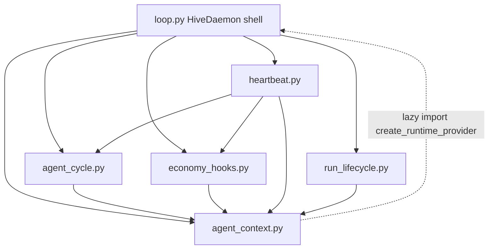

# Stability 04: Loop decomposition (behavior-preserving module split)

## Goal

Split `src/hive/daemon/loop.py` (~1360 lines; guardrail `< 1500` in `tests/test_solid_validation.py`) into focused modules **without changing runtime behavior**, improving reviewability and reducing merge conflict risk.

**Prerequisite:** [stability-03](stability-03-toolkit-factory-hardening.md) — `ToolkitFactory` injection, guardrails wiring, and removal of dead `_orch_manager` should land first so extraction does not fight factory refactors.

## Why (stability)

`HiveDaemon` currently owns lifecycle, heartbeat scheduling, per-agent cycle orchestration, economy/life events, provider/profile caches, and shutdown. A single file makes regressions hard to spot and encourages accidental coupling. Extraction creates stable seams for future fail-closed and extension wiring (plans 01–02) without changing semantics today.

## Current state (post 01/03)

**Monolith:** `src/hive/daemon/loop.py` (~1360 lines)

| Block | Lines (approx) | Responsibility |
|-------|----------------|----------------|
| `__init__` | 52–208 | Store, factory, budget, guards, wake sources, caches |
| Public API | 210–238 | `hooks`, `budget`, `budget_exceeded`, `add_wake_source`, toolkit delegates |
| `start` | 240–323 | PID lock, store init, resume, log run, alarm task, `_run` |
| `_alarm_check_loop` | 325–340 | Due-alarm polling |
| `_run` | 342–471 | Heartbeat: plugins, gather cycles, economy, retention, swarm, sleep/wake |
| `_run_agent_cycle_*`, phases | 473–1001 | Six-phase agent cycle (~530 lines) |
| `_process_payday`, `_process_life_events` | 1003–1124 | Economy LLM side path (budget-aware per plan 01) |
| Cache helpers | 1126–1218 | Suffering/memory/persona/provider/profile/emit/peers |
| `stop` | 1220–1223 | Break heartbeat sleep |
| `_resume_agents`, `_shutdown` | 1225–1368 | Restart + checkpoint + life summaries |

**Already extracted (do not duplicate):**

| Module | Role |
|--------|------|
| `budget.py` | `BudgetTracker`, spend recording |
| `gates.py` | `CostBudgetGuard`, `PhaseGuard` protocols |
| `hooks.py` | `HookRegistry`, phase guards |
| `phase.py` | `CyclePhase`, `PhaseGate` |
| `wakeup.py` | `WakeSource`, `CompositeWakeSource`, `A2AWakeSource` |
| `toolkit_factory.py` | Toolkit construction, `tool_names` cache |

**Naming conflict:** `src/hive/daemon/lifecycle.py` already exists (CLI spawn/kill helpers). Run lifecycle extraction uses **`run_lifecycle.py`**, not `lifecycle.py`.

**Size test:** `tests/test_solid_validation.py::test_daemon_loop_not_growing` asserts `loop.py < 1500` lines.

## Proposed module boundaries

### 1. `agent_context.py` (~100 lines) — per-agent caches

**Class:** `AgentContextCache(daemon)`

| Move from `HiveDaemon` | Notes |
|------------------------|-------|
| `_get_suffering` | Dict stays on daemon (`_suffering`) |
| `_get_memory` | Dict stays on daemon (`_memories`) |
| `_get_persona` | Dict stays on daemon (`_personas`) |
| `_get_provider` | Uses lazy `hive.daemon.loop.create_runtime_provider` for test patch compat |
| `_load_profile` | Profile cache on daemon (`_profile_cache`) |
| `_get_peer_summaries` | Async store read |
| `_emit` | Event log append |

**HiveDaemon:** thin delegates `self._context.get_suffering(...)` etc.; cache dicts remain daemon fields initialized in `__init__`.

### 2. `agent_cycle.py` (~550 lines) — six-phase cycle

**Class:** `AgentCycleRunner(daemon, context: AgentContextCache)`

| Move from `HiveDaemon` | Notes |
|------------------------|-------|
| `_run_agent_cycle_guarded` | Semaphore + timeout isolation |
| `_run_agent_cycle` | Hook emit cycle_start/end |
| `_enter_phase`, `_exit_phase` | Guard + hook ceremony |
| `_run_agent_cycle_inner` | All six phases unchanged |
| `_check_parent_rollup` | GoalEngine subtask rollup |

**HiveDaemon:** `self._cycle_runner = AgentCycleRunner(self, self._context)`; public test hooks `_run_agent_cycle`, `_run_agent_cycle_guarded` delegate.

### 3. `economy_hooks.py` (~125 lines) — economy side paths

**Class:** `EconomyHooks(daemon, context: AgentContextCache)`

| Move from `HiveDaemon` | Notes |
|------------------------|-------|
| `_process_payday` | Sync world work tick |
| `_process_life_events` | Budget kill-switch + LLM + suffering/narrative |

**HiveDaemon:** `_process_payday` / `_process_life_events` delegate (tests call these on daemon).

### 4. `heartbeat.py` (~135 lines) — main loop body

**Class:** `HeartbeatLoop(daemon, cycle_runner: AgentCycleRunner, economy: EconomyHooks, context: AgentContextCache)`

| Move from `HiveDaemon` | Notes |
|------------------------|-------|
| `_run` (full body) | Plugin hot-load, gather, sub-agent kill, economy hooks, retention, swarm, composite wake sleep |

**HiveDaemon:** `await self._heartbeat.run(max_cycles)` from `start()`.

### 5. `run_lifecycle.py` (~200 lines) — daemon run lifecycle

**Class:** `RunLifecycle(daemon, context: AgentContextCache)`

| Move from `HiveDaemon` | Notes |
|------------------------|-------|
| `start` (PID + init + log + alarm + `_run`) | Atomic PID write preserved |
| `_alarm_check_loop` | 15s poll |
| `_resume_agents` | Checkpoint restore, parked-agent semantics |
| `_shutdown` | PID unlink, alarm cancel, checkpoints, life summaries, log cleanup |

**HiveDaemon:** `start()` / `_resume_agents()` / `_shutdown()` / `_alarm_check_loop()` delegate.

`stop()` stays on `HiveDaemon` (3 lines; sets `_running` + `_stop_event`).

### 6. `loop.py` (target **< 400 lines**) — shell + wiring

Retains:

- Module docstring, logger
- `create_runtime_provider` re-export (test patches: `hive.daemon.loop.create_runtime_provider`)
- `HiveDaemon.__init__` (all field wiring, budget guard registration)
- Properties: `hooks`, `budget`, `budget_exceeded`
- `add_wake_source`, `_build_toolkits`, `_get_tool_names`, `_build_tools_description`
- `stop()`
- Thin delegates to composed runners

Optional: re-export from `hive.daemon` `__init__.py` — not required if `from hive.daemon.loop import HiveDaemon` unchanged.

## Import hygiene (avoid cycles)



- Extracted modules import `HiveDaemon` only under `TYPE_CHECKING`, or take `daemon: Any` / protocol.
- `_get_provider` lazy-imports `hive.daemon.loop.create_runtime_provider` at call time so existing test patches keep working.
- No extracted module imports `heartbeat` or `run_lifecycle`.

## Public API (stable)

| Import | Status |
|--------|--------|
| `from hive.daemon.loop import HiveDaemon` | **Must remain** (CLI, API, tests, `hive/__init__.py`) |
| `from hive.daemon.loop import create_runtime_provider` | Re-export for monkeypatch targets |
| `daemon._run_agent_cycle`, `_run_agent_cycle_guarded`, `_process_life_events`, `_get_suffering` | Keep as daemon methods (delegate) — adversarial + budget tests |

## Non-goals

- Changing phase order, guard registration, or cycle return strings
- Renaming `HiveDaemon` or moving it out of `loop.py`
- Wiring `ManualPauseGuard` or CLI pause unification (**stability-02**)
- Splitting `_run_agent_cycle_inner` into per-phase modules (optional later refactor inside `agent_cycle.py`)
- Shell flag heuristics, default guardrails/approval/budget config
- New features or behavior changes

## Risks and mitigations

| Risk | Mitigation |
|------|------------|
| Circular imports | Lazy import for `create_runtime_provider`; runners hold daemon ref, not vice versa at import time |
| Subtle `self` binding / state location bugs | Cache dicts stay on `HiveDaemon`; pure method moves |
| Test patch paths break | Re-export `create_runtime_provider` from `loop.py`; lazy import in `_get_provider` |
| `lifecycle.py` name clash | Use `run_lifecycle.py` |
| Oversized new modules | Add per-module line guards in `test_solid_validation.py` (≤ 600 lines each) |
| Merge conflicts with 02/03 | Execute after 03; do not touch gates/factory wiring beyond moves |

**Rollback:** single revert of extraction commit(s).

## Acceptance criteria

```bash
uv run pytest tests/adversarial/ -q --tb=short
uv run pytest tests/test_budget.py tests/test_daemon_setup.py tests/test_daemon_integration.py tests/test_phase.py tests/test_solid_validation.py -q --tb=short
uv run mypy src/hive/daemon/
```

- [ ] `loop.py` **< 500 lines** (stretch **< 400**)
- [ ] New modules each **< 600 lines** (guardrails in `test_solid_validation.py`)
- [ ] Total `src/hive/daemon/*.py` line count ±5% of pre-split (no accidental duplication)
- [ ] `git diff` shows moves with no logic edits (review checklist: phase order, budget checks, hook emits unchanged)
- [ ] All tests above pass without import path changes for `HiveDaemon`
- [ ] No new `# type: ignore` in extracted modules (existing daemon test ignores OK)

## Implementation order (single PR or stepped)

1. **`agent_context.py`** — extract caches; wire delegates; run targeted tests (`test_daemon_caching`, `test_feedback_loops`).
2. **`agent_cycle.py`** — largest chunk; run cycle tests (`test_daemon_approval`, `test_budget`, adversarial resilience).
3. **`economy_hooks.py`** — run `test_feedback_loops`, budget life-event tests.
4. **`heartbeat.py`** — run `test_daemon_integration`, concurrency/lifecycle tests.
5. **`run_lifecycle.py`** — run `test_daemon_lifecycle`, `test_auto_resume`.
6. **Trim `loop.py`** — update `test_solid_validation.py` thresholds (loop `< 500`, new modules `< 600`).
7. **Full verify** — adversarial suite + mypy.

**PR strategy:** one PR acceptable for this track item if CI green; alternatively two PRs (context+cycle+economy, then heartbeat+run_lifecycle) for easier review.

## Estimate

**L** — 1–2 days focused mechanical refactor (single PR) or **4–6 days** across stepped PRs. **Med–High** risk due to touch area; mitigated by adversarial gate (plan 05) and fail-closed budget tests (plan 01).

**Depends on:** plan 03 (factory stable). **Blocks nothing**; plan 02 can proceed in parallel on extension points.
