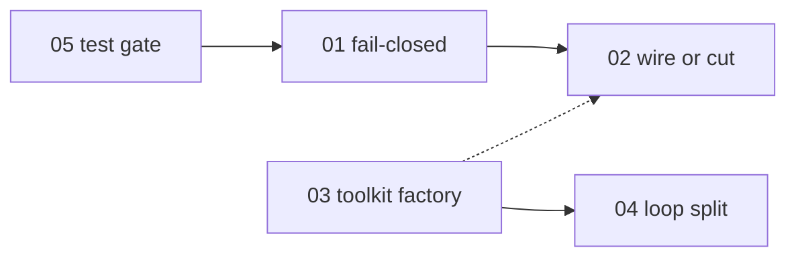

# Stability track index

Ordered execution plan for daemon robustness refactors. Security hardening (Changes 1–9, SSRF, shell jail, H3 allowlist) is treated as largely complete -- these plans address **false safety**, dead extension points, structural debt, and test gates.

**Stability track status:** largely complete (2026-07-22). Fix phases A--G are complete ([fix-phases-index.md](fix-phases-index.md)). **Current:** [framework-stabilization-index.md](framework-stabilization-index.md) -- measured merge-gate recovery and verified runtime defects.

## Recommended execution sequence

| Order | Plan | Effort | Risk | Depends on |
|-------|------|--------|------|------------|
| 1 | [stability-05-resilience-test-gate.md](stability-05-resilience-test-gate.md) | **S** | Low | -- — **implemented** (2026-07-22); CI `resilience` job + adversarial gaps closed |
| 2 | [stability-01-daemon-fail-closed.md](stability-01-daemon-fail-closed.md) | **M** | Med | 05 (CI catches regressions) — **implemented** |
| 3 | [stability-03-toolkit-factory-hardening.md](stability-03-toolkit-factory-hardening.md) | **M** | Low | -- — **plan refreshed** (2026-07-22): inject guardrails, cache `tool_names`, orchestrator ctor workspace, remove dead `_orch_manager` |
| 4 | [stability-02-extension-points-wire-or-cut.md](stability-02-extension-points-wire-or-cut.md) | **M** | Med | 01 (pause/budget semantics clear) — **implemented** (2026-07-22) |
| 5 | [stability-04-loop-decomposition.md](stability-04-loop-decomposition.md) | **L** | Med–High | 03 (factory stable before moves) — **plan refreshed** (2026-07-22): 5 modules (`agent_context`, `agent_cycle`, `economy_hooks`, `heartbeat`, `run_lifecycle`); avoids `lifecycle.py` name clash |

**Start here:** [stability-05](stability-05-resilience-test-gate.md) -- low effort, immediately protects the rest of the track. Follow with [stability-01](stability-01-daemon-fail-closed.md) for the highest-impact stability fix (guard/budget fail-closed).

## Merge gate command

Run before opening or merging stability PRs:

```bash
uv run pytest tests/adversarial/ -v --tb=short
uv run pytest tests/ -v
uv run ruff check src/ tests/
uv run mypy src/
```

CI enforces the adversarial suite via the dedicated `resilience` job (`pytest tests/adversarial/ -v --tb=short -x` on Python 3.12). Run the merge gate command locally before stability PRs as well.

## Dependencies (diagram)



- **05 → 01:** Guard behavior change must update adversarial tests; gate prevents silent revert.
- **01 → 02:** Daemon-wide pause vs budget kill-switch should be documented before wiring `ManualPauseGuard`.
- **03 → 04:** Inject guardrails / remove dead `_orch_manager` before moving code out of `loop.py`.
- **03 ↔ 02:** Independent; protocol shrink can parallel factory work.

## Effort legend

| Size | Meaning |
|------|---------|
| **S** | ≤ 1 day, mostly CI/docs/tests |
| **M** | 2–3 days, focused module changes |
| **L** | 4+ days or multi-PR mechanical refactor |

## Risk legend

| Level | Meaning |
|-------|---------|
| **Low** | Structural / test-only; behavior unchanged |
| **Med** | Behavior change with clear rollback (config flag) |
| **Med–High** | Large move PRs; needs full suite + careful review |

## Out of scope for stability track

Defer to product/security decisions or separate tracks:

| Item | Reason |
|------|--------|
| Default `guardrails.enabled: true` | Security/product; breaks local dev expectations |
| Default `approval.enabled: true` | HITL product decision |
| Default non-zero `budget_usd` | Deployment template, not framework default |
| Shell flag heuristic rewrite | Security edge cases; track separately from daemon stability |
| PostgreSQL / second `StoreProtocol` implementation | YAGNI until needed |
| Full swarm routing implementation | Product feature, not stability |
| Consolidating `hardening-guide.md` / `hardening-spec.md` / audit doc | Docs hygiene -- optional cleanup in plan 02 doc step |
| Flipping adversarial tests for SSRF/shell to CI-only on main | Already in full pytest |

## Optional later (after stability track)

- Collapse six-phase ceremony if no external `phase_enter` subscribers (grep `.hooks.on("phase_enter"`).
- Config-gated `FileWakeSource` for plugin watch scenarios.
- `daemon.guards_fail_closed: false` escape hatch removal once stable.
- Per-module line limits in `test_solid_validation.py` after plan 04 (`loop.py` < 500, extracted modules < 600 each).

## Plan files

1. [stability-01-daemon-fail-closed.md](stability-01-daemon-fail-closed.md)
2. [stability-02-extension-points-wire-or-cut.md](stability-02-extension-points-wire-or-cut.md)
3. [stability-03-toolkit-factory-hardening.md](stability-03-toolkit-factory-hardening.md)
4. [stability-04-loop-decomposition.md](stability-04-loop-decomposition.md)
5. [stability-05-resilience-test-gate.md](stability-05-resilience-test-gate.md)

## Surprises from code review (priority hints)

These affect ordering or scope -- not blockers, but teams should know before executing:

1. **Pause semantics split (plan 02 done)** -- `hive pause --all` sets per-agent `AgentStatus.PAUSED`; daemon-wide freeze uses `hive daemon pause` / `ManualPauseGuard` / `.hive/daemon.paused`.
2. **`HiveDaemon._orch_manager` is dead code** -- only `ToolkitFactory._orch_manager` is used. Plan 03 removes it.
3. **`on_exceeded` kill-switch** -- wired in plan 01 (`loop.py` sets `_budget_exceeded`); plan 05 adds adversarial regressions so revert fails CI.
4. **`test_guard_exception_allows_by_default`** -- still encodes extension fail-open (by design); budget guards use fail-closed via `guards_fail_closed` (plan 01 done). Plan 05 adds adversarial daemon integration regressions so kill-switch revert fails CI.
5. **macOS FD leak test did not count FDs** -- plan 05 fixes with `/proc` (Linux) or `lsof` (macOS), skip when unavailable.
6. **Concurrent goal-generation overshoot** -- guard checked at phase entry; two agents can overshoot by ≤ one generation. Plan 05 adds bounded adversarial test documenting the PARTIAL gap (production fix deferred).
7. **Default swarm policy is `PassiveSwarmPolicy`** (plan 02 done); `DefaultSwarmPolicy` is opt-in log-only routing hints.
8. **Life-event LLM spend recording** -- plan 01 implemented; adversarial suite should mirror key regressions (plan 05).
